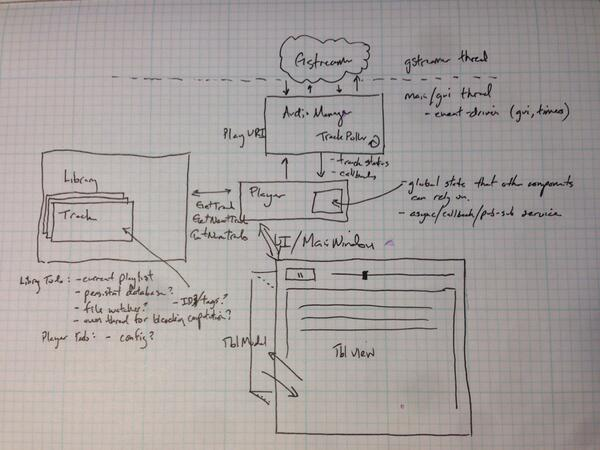

### ghost

    $ ./ghost -help
    -help
    --dir=/path/to/library/             music library path.
    --pls=/path/to/playlist.pls         play/stream playlist.

##### Design

Rev 1:

##### Build

    ./init
    
    cd build

Posix:

    cmake ..
    make

Windows:

    cmake .. -G "Visual Studio 12 Win64"

##### Platform Dependencies

Ubuntu / Debian:

    apt-get install cmake libgstreamer1.0-dev gstreamer1.0-plugins-base gstreamer1.0-plugins-ugly qt5-default libgtk2.0-dev libevent-dev

Arch Linux:

    pacman -S cmake gstreamer gst-plugins-base gst-plugins-ugly qt5-base glib libmad

Windows 7:

    Visual Studio Express 2013
    Visual Studio 2012 Redistributable
    CMake
    Python 3
    Qt5
    Gstreamer
